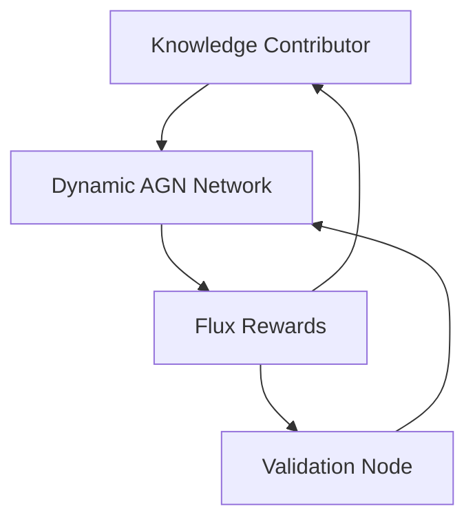

# **FluxWallet: The Future of Decentralized Intelligence**

[](https://github.com/ConicuConsulting/FluxWallet/actions)
[](https://creativecommons.org/licenses/by-nc-sa/4.0/](https://medium.com/@callum_26623/introducing-the-empathic-innovation-license-eil-a-framework-for-responsible-use-of-7e6a96cfc3bc))
[](https://github.com/ConicuConsulting/FluxWallet/graphs/contributors)
[](https://github.com/ConicuConsulting/FluxWallet/issues)

FluxWallet is not just a wallet—it’s the cornerstone of the next generation of decentralized systems. Built upon **Cube4D**, **Active Graph Networks (AGN)**, and **Dynamic Relationship Expansion (DRE)**, FluxWallet redefines scalability, security, and adaptability while incentivizing **knowledge-building through collaboration**.

---

## **🚀 Features**

### **Core System Features**
- **4D DNS Integration**: Hierarchical DNS system for spatial-temporal wallet structures.
- **GitHub OAuth Security**: Robust authentication with multi-factor protocols.
- **Tamper-proof Transactions**: Transactions validated through mathematical checksums and spatial relationships.
- **Horcrux Mechanism**: Decentralized data validation through online/offline nodes.

### **Knowledge-Building Distribution**
FluxWallet rewards users and contributors by:
- **Dynamic Knowledge Contributions**: Users earn Flux for building relationships, expanding the AGNs, and validating data through horcrux mechanisms.
- **Commission on Expansions**: Contributors whose work is expanded upon receive a proportional Flux reward.
- **Transparent Distribution Metrics**: Flux tokens are distributed based on measurable contributions, enabling fair and equitable participation.

---

## **🌌 Flux Distribution Through Knowledge Building**

The ecosystem is designed to encourage collaboration, innovation, and trustless contributions. Users actively engage in:
1. **Knowledge Contribution**:
   - Add validated data, relationships, or context to the AGN ecosystem.
   - Enhance the value of existing nodes through dynamic relationships.

2. **Expansion and Commission**:
   - Contributors earn **Flux tokens** as their knowledge is expanded upon.
   - Transactions between users are validated against these dynamic relationships.

3. **Validation Nodes**:
   - Users act as validators, ensuring the integrity of the data while earning additional rewards.
   - Offline validation is supported for airgapped systems.

---

### **Visualizing the Flux Distribution Workflow**


---

## **📚 Ecosystem Concepts**

FluxWallet is part of a larger vision. Dive deeper into its foundations:  
- **[Dynamic Relationship Expansion (DRE)](https://medium.com/cognitive-driven-ai-the-future-of-relational/dynamic-relationship-expansion-dre-framework-iteration-4-09443979f9ea)**  
- **[Cube4D](https://medium.com/@callummaystone/cube4d-redefining-4d-data-structures-7e2d1f3c8e4e)**  
- **[Active Graph Networks (AGN)](https://medium.com/@callummaystone/introducing-active-graph-networks-b4d5c8e76f1b)**  
- **[Horcrux Validation Mechanism](https://medium.com/@callummaystone/horcrux-validation-explained-8343e2d7b98f)**  

---

## **🛠️ Getting Started**

1. Clone this repository:
   ```bash
   git clone https://github.com/ConicuConsulting/FluxWallet.git
   cd FluxWallet
   ```
2. Install dependencies:
   ```bash
   pip install -r requirements.txt
   ```
3. Run the application:
   ```bash
   python src/wallet.py
   ```

---

## **🌐 Community**

Join the movement to shape the future of decentralized intelligence:
- **[GitHub Discussions](https://github.com/ConicuConsulting/FluxWallet/discussions)**
- **[Submit Issues](https://github.com/ConicuConsulting/FluxWallet/issues)**
- **[Follow on Twitter](https://twitter.com/ConicuConsulting)**

---

## **📜 License**

This project is licensed under the [CC BY-NC-SA 4.0 License](https://creativecommons.org/licenses/by-nc-sa/4.0/).
