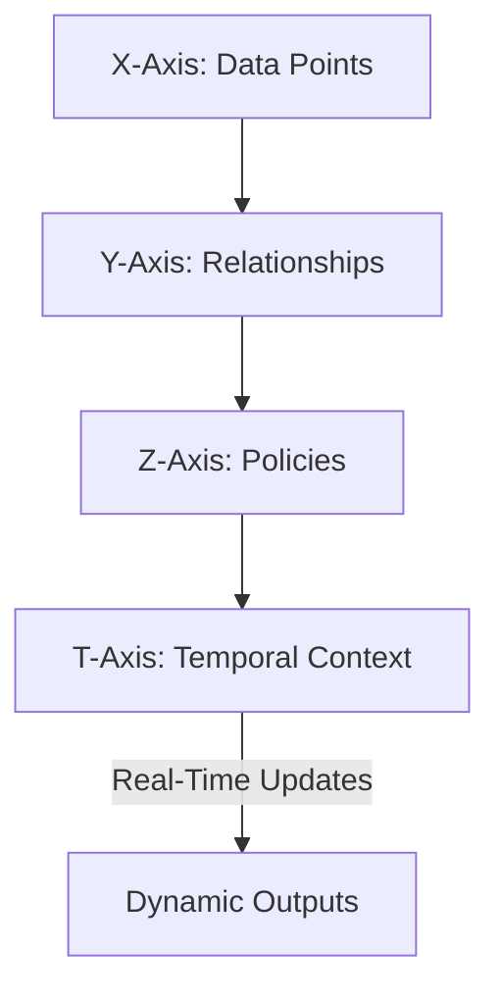
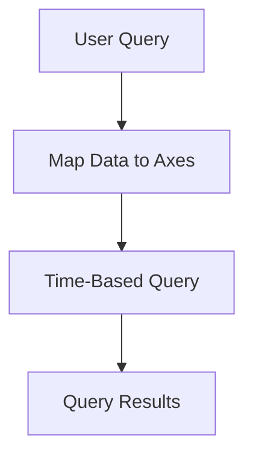

### **Article 3: Cube4D – The Multidimensional Backbone of FluxWallet**  
**Subtitle**: Unlocking the Power of Spatial, Temporal, and Contextual Intelligence

---

#### **Introduction**  
**Cube4D** is the multidimensional data framework powering FluxWallet. By integrating spatial (X, Y, Z), temporal (T), and contextual dimensions, Cube4D enables advanced data structuring, analysis, and validation. Unlike traditional systems, Cube4D is inherently scalable, adaptable, and designed for decentralized ecosystems.

*Related Articles*:  
- [Cube4D: Redefining 4D Data Structures](https://medium.com/@callummaystone/cube4d-redefining-4d-data-structures-7e2d1f3c8e4e)  
- [FluxWallet Technical Overview](https://medium.com/@callummaystone/fluxwallet-technical-overview-34e7f1c7d89a)  

---

#### **Core Dimensions of Cube4D**  

1. **X-Axis (Data Points)**:  
   Represents individual entities such as wallets, transactions, or nodes.  

2. **Y-Axis (Relationships)**:  
   Defines the connections between data points, whether hierarchical, transactional, or contextual.  

3. **Z-Axis (Policies)**:  
   Governs adaptability and validation logic, such as checksum rules and fraud detection.  

4. **T-Axis (Temporal)**:  
   Adds a time-sensitive layer, enabling historical tracking and real-time adaptability.  

*Diagram*: Cube4D Framework  

---

#### **How Cube4D Works in FluxWallet**  

1. **Data Structuring Across Axes**:  
   Each wallet (node) is mapped across the four axes, encoding its position, relationships, and policies.  

2. **Temporal Querying**:  
   Retrieve data from any point in time, enabling seamless rollback and trend analysis.  
   Example:  
   - Querying wallet balances at `T-1` and comparing changes with `T`.  

3. **Policy Enforcement**:  
   Policies are encoded on the Z-Axis, ensuring consistent validation across the network.  
   Example:  
   - A policy flag triggers fraud checks when transaction volume exceeds a threshold.  

*Diagram*: Temporal Querying Workflow  

---

#### **Key Features of Cube4D**  

1. **Scalable Multidimensional Structuring**:  
   - Supports billions of nodes and relationships without degradation.  

2. **Advanced Temporal Insights**:  
   - Analyze trends, predict outcomes, and enable real-time decision-making.  

3. **Contextual Adaptability**:  
   - Nodes and relationships adapt based on contextual inputs and temporal changes.  

---

#### **Applications of Cube4D in FluxWallet**  

1. **Real-Time Fraud Detection**:  
   - Transactions are monitored in real-time against predefined policies on the Z-Axis.  
   - Example: A sudden burst of high-value transactions triggers a fraud validation node.  

2. **Offline Validation**:  
   - Cube4D enables local validation by referencing cached data and horcrux mappings.  
   - Example: An airgapped node validates transactions using temporal and policy-based relationships.  

3. **Historical Analysis**:  
   - Enables detailed analysis of wallet interactions over time.  
   - Example: Investigating the relationship between transaction volume and wallet activity.  

---

#### **Why Cube4D is a Game-Changer**  

1. **Enhanced Decision-Making**:  
   - By combining temporal and spatial insights, users gain unparalleled clarity.  

2. **Improved Security**:  
   - Policies encoded on the Z-Axis ensure tamper-proof validation.  

3. **Scalable Intelligence**:  
   - Cube4D supports dynamic growth without compromising performance.  

---

#### **Roadmap for Cube4D in FluxWallet**  

1. **Phase 1: Framework Implementation**  
   - Develop core Cube4D logic for node structuring and policy encoding.  

2. **Phase 2: Feature Expansion**  
   - Add advanced temporal querying and real-time fraud detection.  

3. **Phase 3: Community Engagement**  
   - Open-source Cube4D for broader adoption and collaboration.  

---

#### **Call to Action**  
Cube4D is the engine driving FluxWallet’s multidimensional intelligence. Join us in shaping the future:  
- **[FluxWallet Repository](https://github.com/ConicuConsulting/FluxWallet)**  
- **[Cube4D Explained](https://medium.com/@callummaystone/cube4d-redefining-4d-data-structures-7e2d1f3c8e4e)**  
