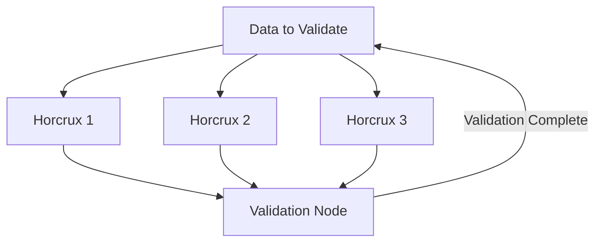
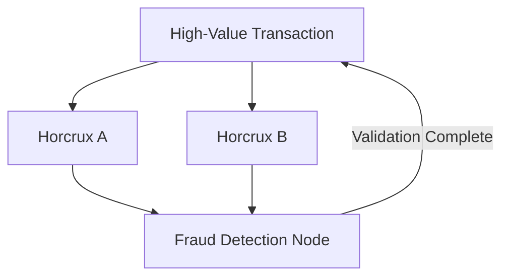

### **Article 4: Horcrux Validation Mechanism – Decentralized Trust in FluxWallet**  
**Subtitle**: Enabling Trustless Validation with Spatial Relationships and Immutable Truths  

---

#### **Introduction**  
The **Horcrux Validation Mechanism** is FluxWallet's answer to decentralized trust and data integrity. Inspired by principles of distributed systems and cryptography, this mechanism segments and distributes data into **horcruxes**, which act as keys to validate and decrypt information. By leveraging spatial relationships, horcruxes ensure that validation remains secure, scalable, and resistant to tampering.

*Related Articles*:  
- [FluxWallet Technical Overview](https://medium.com/@callummaystone/fluxwallet-technical-overview-34e7f1c7d89a)  
- [Dynamic Relationship Expansion (DRE) Framework](https://medium.com/cognitive-driven-ai-the-future-of-relational/dynamic-relationship-expansion-dre-framework-iteration-4-09443979f9ea)  

---

#### **How Horcrux Validation Works**  

1. **Segmentation and Distribution**:  
   - Data is divided into multiple horcruxes, each representing a segment of the validation process.  
   - Horcruxes are distributed across online and offline nodes.  

2. **Spatial Relationships**:  
   - Each horcrux encodes its position in a **4D DNS** space, ensuring it can only be validated with the correct spatial references.  

3. **Quorum-Based Validation**:  
   - A minimum quorum of horcruxes must be accessed to validate data.  
   - Example: A transaction requires 3 out of 5 horcruxes for approval.  

*Diagram*: Horcrux Validation Workflow  

---

#### **Key Features of the Horcrux Mechanism**  

1. **Decentralized Validation**:  
   - Validation is distributed across multiple nodes, eliminating single points of failure.  

2. **Offline and Airgapped Networks**:  
   - Local horcruxes enable validation even in disconnected environments.  

3. **Tamper-Proof Integrity**:  
   - Horcruxes are encoded with checksums, ensuring their integrity during the validation process.  

4. **Flexibility with Custom Horcrux Rules**:  
   - Networks can define their own validation rules and quorum thresholds.  

---

#### **Use Cases of the Horcrux Mechanism**  

1. **Airgapped Networks**:  
   - In secure environments, horcruxes stored locally validate transactions without requiring external connectivity.  
   - Example: A government agency uses FluxWallet for classified transactions.  

2. **Global Decentralized Networks**:  
   - Online horcruxes enable trustless validation across distributed systems.  
   - Example: A cross-border transaction between wallets is validated using horcruxes from multiple regions.  

3. **Fraud Detection and Prevention**:  
   - The quorum mechanism flags anomalies by requiring additional validation steps for suspicious activity.  

*Diagram*: Fraud Detection with Horcruxes  

---

#### **Advantages of the Horcrux Mechanism**  

1. **Enhanced Security**:  
   - By requiring multiple horcruxes, data remains secure even if one segment is compromised.  

2. **Improved Scalability**:  
   - The mechanism supports large-scale networks with millions of nodes and horcruxes.  

3. **Adaptability**:  
   - Customizable quorum rules make the mechanism suitable for various use cases.  

---

#### **Roadmap for Horcrux Validation in FluxWallet**  

1. **Phase 1: Development**  
   - Implement basic horcrux segmentation and quorum validation.  

2. **Phase 2: Feature Expansion**  
   - Add support for custom quorum rules and airgapped validations.  

3. **Phase 3: Optimization**  
   - Scale the mechanism to handle billions of nodes while ensuring minimal latency.  

---

#### **Call to Action**  
The Horcrux Validation Mechanism is redefining trust in decentralized systems. Explore how this innovative approach powers FluxWallet:  
- **[FluxWallet Repository](https://github.com/ConicuConsulting/FluxWallet)**  
- **[Technical Overview](https://medium.com/@callummaystone/fluxwallet-technical-overview-34e7f1c7d89a)**  
