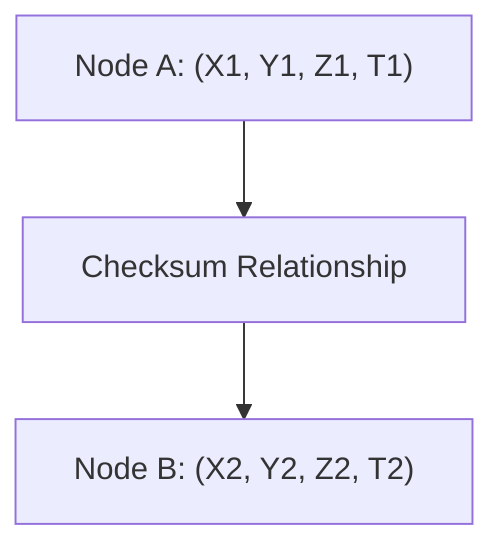
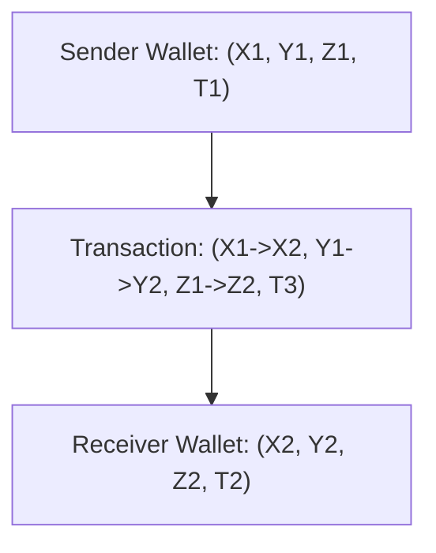

### **Article 5: 4D DNS – A New Dimension for Data Integrity and Scalability**  
**Subtitle**: Revolutionizing Data Structuring with Spatial, Temporal, and Logical Precision  

---

#### **Introduction**  
The traditional Domain Name System (DNS) has powered the internet for decades, mapping hierarchical domains to IP addresses. But as data grows exponentially and systems demand greater complexity, a new paradigm is required. Enter **4D DNS**: a multidimensional framework that incorporates spatial (X, Y, Z), temporal (T), and logical relationships into the heart of data structuring.

*Related Articles*:  
- [Cube4D: Redefining 4D Data Structures](https://medium.com/@callummaystone/cube4d-redefining-4d-data-structures-7e2d1f3c8e4e)  
- [FluxWallet Technical Overview](https://medium.com/@callummaystone/fluxwallet-technical-overview-34e7f1c7d89a)  

---

#### **How 4D DNS Works**  

1. **Hierarchical Mapping**:  
   - Each data point (node) is assigned a unique 4D address (XYZ.T).  
   - Spatial dimensions (X, Y, Z) encode the node's position in a logical hierarchy.  
   - Temporal dimension (T) tracks state changes and historical versions.  

2. **Dynamic Addressing**:  
   - Nodes can adapt their relationships and addresses dynamically without disrupting the network.  

3. **Validation Through Relationships**:  
   - Relationships between nodes act as checksums, ensuring data integrity and preventing tampering.  

*Diagram*: 4D DNS Addressing Workflow  

---

#### **Key Features of 4D DNS**  

1. **Spatial Organization**:  
   - Nodes are structured logically, enabling intuitive traversal and querying.  

2. **Temporal Versioning**:  
   - Changes to nodes are tracked over time, enabling rollbacks and trend analysis.  

3. **Decentralized Validation**:  
   - Address relationships are validated through checksum mechanisms, ensuring data consistency across the network.  

---

#### **Use Cases of 4D DNS in FluxWallet**  

1. **Decentralized Wallets**:  
   - Each wallet is a node with a unique 4D address, allowing for seamless validation and traversal.  
   - Example: A wallet with multiple child wallets (sub-nodes) for specific purposes.  

2. **Transaction Mapping**:  
   - Transactions between wallets are mapped using 4D relationships, encoding time, source, and destination.  

3. **Airgapped Networks**:  
   - 4D DNS enables local validation in offline environments by referencing cached horcruxes and spatial relationships.  

*Diagram*: Transaction Mapping in 4D DNS  

---

#### **Advantages of 4D DNS**  

1. **Infinite Scalability**:  
   - Nodes and relationships scale dynamically, supporting billions of entities.  

2. **Enhanced Security**:  
   - Spatial and temporal relationships act as natural checksums, ensuring tamper-proof integrity.  

3. **Simplified Querying**:  
   - Queries leverage the hierarchical structure for faster and more accurate results.  

---

#### **Roadmap for 4D DNS in FluxWallet**  

1. **Phase 1: Core Implementation**  
   - Develop the 4D addressing scheme and relationship validation.  

2. **Phase 2: Advanced Querying**  
   - Enable spatial and temporal queries for real-time and historical data analysis.  

3. **Phase 3: Community Integration**  
   - Open-source the 4D DNS framework for integration with other decentralized systems.  

---

#### **Call to Action**  
4D DNS is the backbone of FluxWallet, offering unprecedented scalability, security, and adaptability. Join us in shaping this new frontier:  
- **[FluxWallet Repository](https://github.com/ConicuConsulting/FluxWallet)**  
- **[Cube4D Explained](https://medium.com/@callummaystone/cube4d-redefining-4d-data-structures-7e2d1f3c8e4e)**  
