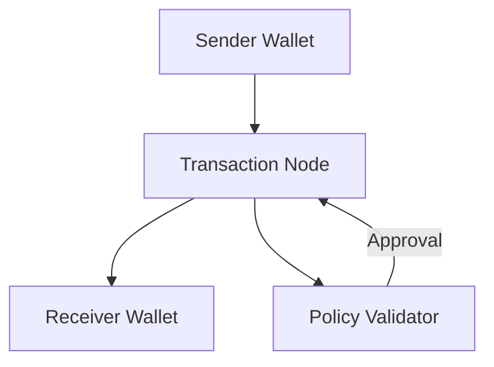
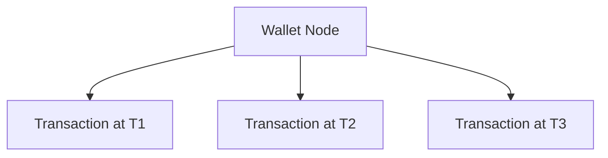
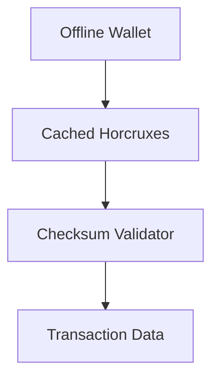

### **Article 2: Dynamic Relationship Expansion (DRE) in FluxWallet**
**Subtitle**: Adaptive Intelligence for a Decentralized Future

---

#### **Introduction**
Dynamic Relationship Expansion (DRE) is the cornerstone of adaptability in FluxWallet. It enables the system to dynamically evolve, ensuring seamless integration of new data, nodes, and relationships without compromising scalability or security. By leveraging **DRE**, FluxWallet transcends traditional constraints, offering unparalleled flexibility and efficiency in decentralized environments.

**Core DRE Concepts**:
1. **Dynamic Expansion**: Relationships evolve and expand in real-time based on new inputs.
2. **Self-Organization**: Nodes autonomously update connections, reducing the need for manual intervention.
3. **Contextual Adaptability**: Relationships are governed by context, ensuring relevance and precision.

*Related Article*: [Dynamic Relationship Expansion (DRE) Framework Iteration 4](https://medium.com/cognitive-driven-ai-the-future-of-relational/dynamic-relationship-expansion-dre-framework-iteration-4-09443979f9ea)

---

#### **How DRE Works in FluxWallet**

1. **Dynamic Node Creation**:
   - New nodes (wallets or transactions) are added seamlessly to the network.
   - Relationships between nodes are established based on spatial (4D DNS) and logical (checksum validation) parameters.

2. **Real-Time Relationship Adjustment**:
   - When a transaction occurs, the relationship between the sender and receiver dynamically adjusts to reflect the new state.
   - Nodes self-organize to maintain optimal network efficiency.

3. **Policy-Driven Expansion**:
   - Relationships are governed by predefined policies.
   - Example: A high-value transaction triggers additional validation steps.

*Diagram*: Dynamic Relationship Workflow

---

#### **Key Features of DRE**

1. **Scalable Relationship Management**:
   - DRE allows for infinite scalability by dynamically pruning or expanding relationships based on contextual importance.

2. **Temporal Awareness**:
   - Relationships are timestamped, enabling historical analysis and rollback functionality.
   - *Example*: Tracking the evolution of a wallet’s connections over time.

3. **Trustless Validation**:
   - Relationships are validated through checksum mechanisms, eliminating reliance on centralized authorities.

*Diagram*: Temporal Relationship Evolution

---

#### **Use Cases of DRE in FluxWallet**

1. **Dynamic Wallet Expansion**:
   - A single wallet expands its relationships as it interacts with other wallets.
   - Example: A wallet linked to a marketplace dynamically establishes relationships with seller wallets.

2. **Fraud Detection**:
   - DRE identifies anomalies in relationship patterns.
   - Example: A sudden spike in high-value transactions triggers fraud validation.

3. **Offline Validation**:
   - DRE ensures that relationships and transactions can be validated locally using cached horcruxes and checksum data.

*Diagram*: Offline Validation Workflow

---

#### **Why DRE is Revolutionary**

1. **Adaptability**:
   - Traditional systems require manual updates for new data. DRE automates this process, reducing overhead and errors.

2. **Efficiency**:
   - By dynamically managing relationships, DRE minimizes redundant connections and optimizes resource utilization.

3. **Security**:
   - Relationships are validated using immutable truths, ensuring trustless operation.

---

#### **Roadmap for DRE in FluxWallet**

1. **Phase 1**: Core Development
   - Build foundational DRE logic for node creation and relationship adjustment.
   - Integrate with FluxWallet’s 4D DNS and horcrux mechanisms.

2. **Phase 2**: Feature Expansion
   - Enable real-time fraud detection using DRE.
   - Develop visual tools for monitoring relationship evolution.

3. **Phase 3**: Deployment and Optimization
   - Optimize DRE for large-scale networks with billions of nodes.
   - Open-source the DRE module for community collaboration.

---

#### **Call to Action**
Dynamic Relationship Expansion is a paradigm shift for decentralized systems. Join the FluxWallet revolution and explore how DRE is redefining adaptability:
- **[FluxWallet Repository](https://github.com/ConicuConsulting/FluxWallet)**
- **[DRE Framework Explained](https://medium.com/cognitive-driven-ai-the-future-of-relational/dynamic-relationship-expansion-dre-framework-iteration-4-09443979f9ea)**
